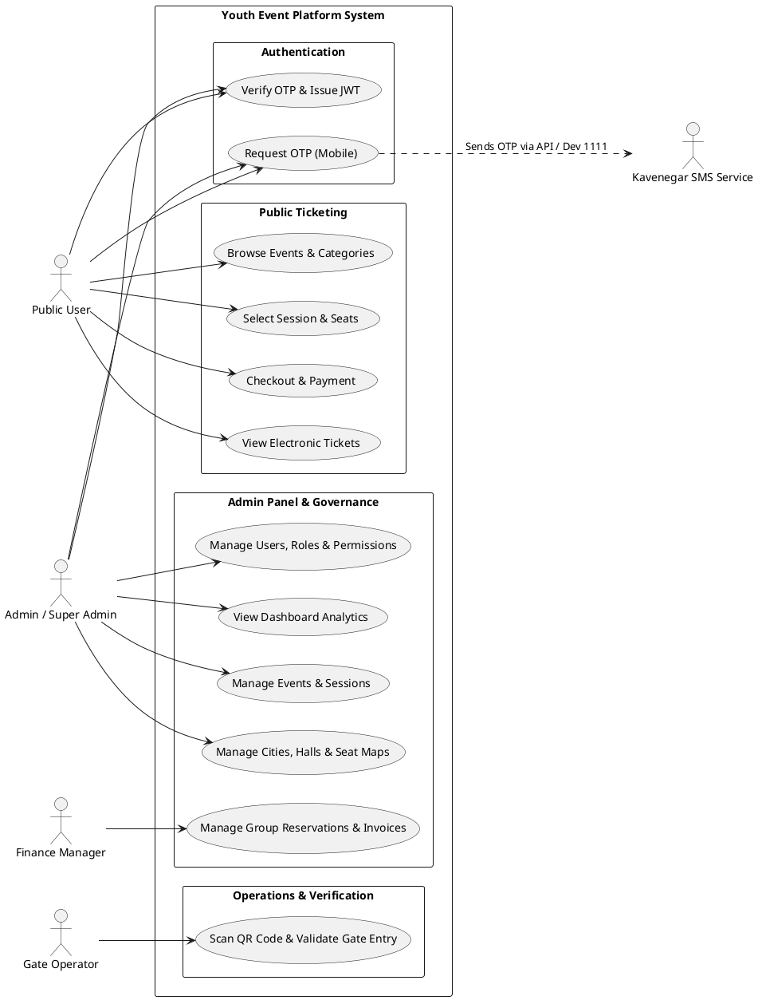

# USE CASES & ARCHITECTURE DOCUMENTATION

## Primary Actors
1. **Public User**: Searches events, reserves seats, pays online, receives QR ticket.
2. **Admin / Manager**: Accesses enterprise dashboard, manages events, cities, halls, seat maps, and sessions.
3. **Super Admin**: Manages system users, roles, permissions, system settings, and audit logs.
4. **Finance Manager**: Oversees sales, school/organization group reservations, invoices, and settlements.
5. **Gate Operator**: Validates tickets at venue gates via QR code scanners.
6. **SMS Provider (Kavenegar)**: Delivers 4-digit OTP codes for authentication.

## Use Case Diagram (PlantUML Format)

